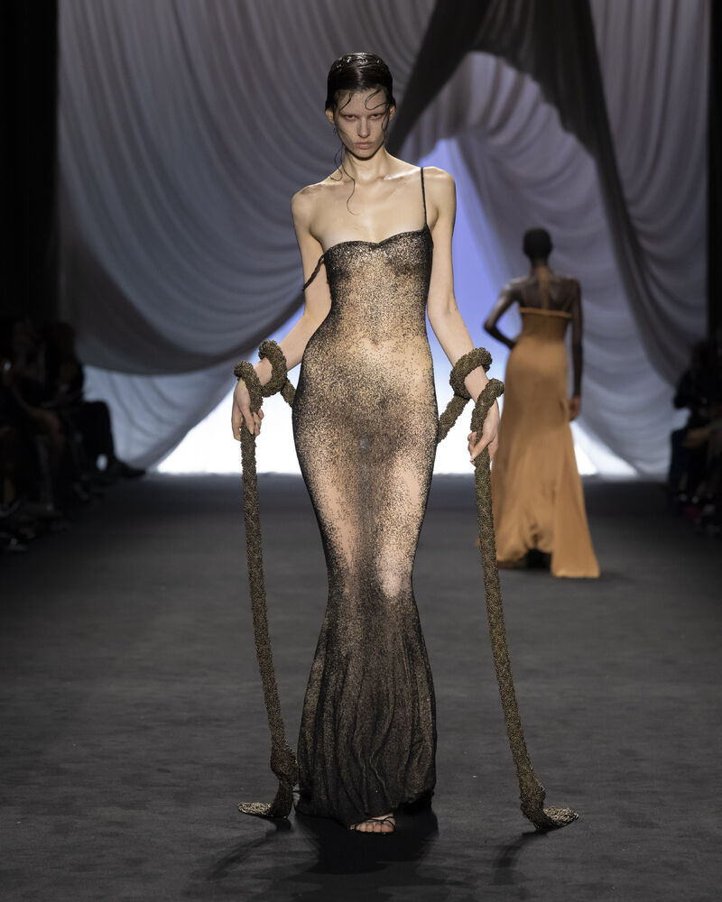
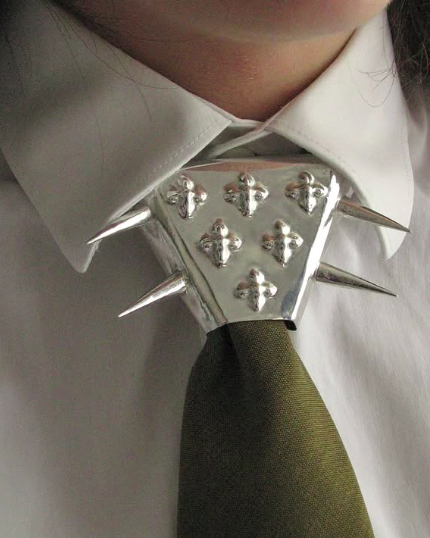
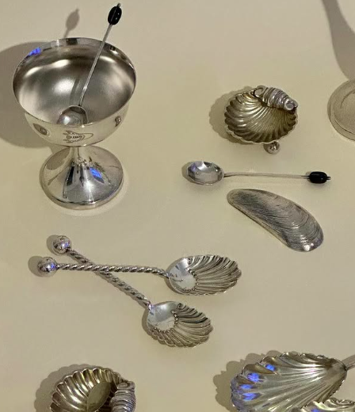
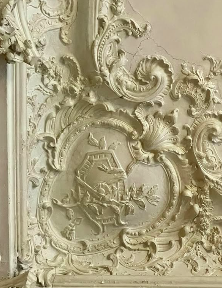
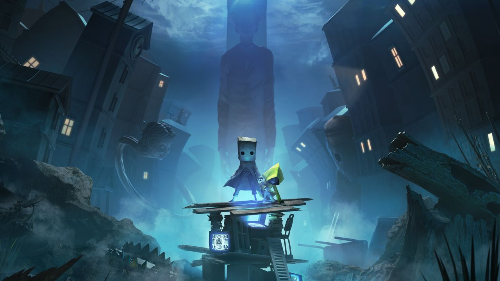

<h2 align="center">💙 Hola, soy Stephanie Monjaraz</h2>

<h3 align="center" style="color:#d3d3d3;">📘 Exploraciones, Inspiraciones y Preferencias Personales</h3>

### 🌀 En lo que pienso constantemente

<table>
  <tr>
    <td align="center">
       
      Jean Paul Gaultier Spring 2025 Couture Collection
    </td>
    <td align="center">
       
      Silver Tie Guard
    </td>
  </tr>
  <tr>
    <td align="center">
       
      Inspiración natural
    </td>
    <td align="center">
       
      Las maravillas del Hôtel de Soubise
    </td>
  </tr>
</table>

---

### 🎶 Música que disfruto últimamente

- 🎵 La petite fille de la mer
<td align="center">
       
    </td>

- 🎵 Ma meilleure Ennemie
- 🎵 Flamme à lunettes
- 🎵 Robbers - The 1975

---

### 🎮 Videojuegos Favoritos

- 🎮 Little Nightmares

<td align="center">
       
    </td>

- 🎮 Dead by Daylight
- 🎮 Inside
- 🎮 Resident Evil (en general)

---

### 📺 Series que recomiendo

- 📺 Arcane
<td align="center">
       
    </td>

- 📺 The Alienist
- 📺 The Glory
- 📺 Anne with an E

---

### 🫐 ¡Ayúdame a completar lo que falta!

💙 Si tienes recomendaciones para música, videojuegos, series o cualquier cosa que pueda interesarme, estaré feliz de conocerlas. 

1. Hola! Soy **Eduardo.** Yo te recomiendo la pelicula de *Lost in translation*. Considero que es una pelicula muy especial ya que personalmente verla fue una experiencia muy padre e inhumana.
